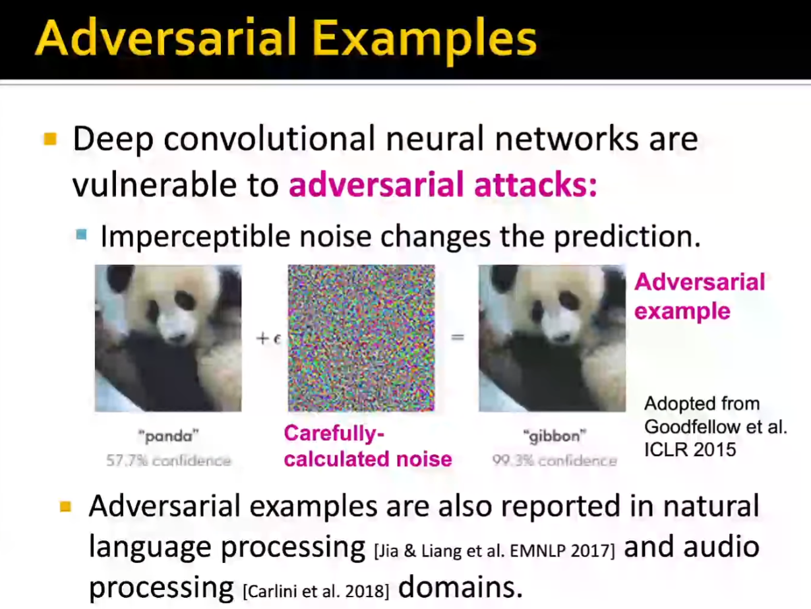

要把深度学习模型部署到现实中，需要模型能经得住一些类似于噪声的破环

How about GNN's Robustness?

#### Attack Possibilities

##### Direct Attack: Attacker node is the target

Modify target node feature, add edges, remove edges.

##### Indirect Attack: attacker node is not the target node

Modify attacker node feature, add edges, remove edges.

#### Formalizing Adversarial Attacks

The attacker want to maximize (**change of target node label prediction**) with **small graph manipulation**.

...... (Mathematical Formulation)

#### Experiments

#### A brief summary

GNN is *not* robust to adversarial attacks but is somewhat robust to indirect attacks and random noise.

GNN的鲁棒性是一个有意义的研究方向